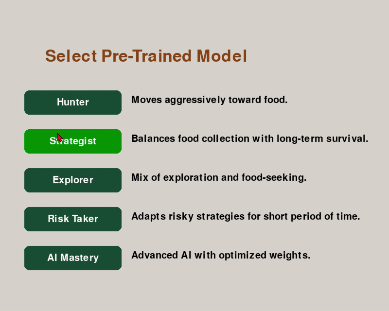

# 🐍 Snake GA — Genetic Algorithm Playground (Curses Edition)
**Snake GA** is an **ASCII-powered**, **terminal-based** project where a **Genetic Algorithm (GA)** teaches a digital snake how to master its tiny universe.  
It’s minimalistic. It’s educational. It’s addictive.  
Oh, and did we mention it runs right in your terminal? (No fancy graphics. Just raw algorithmic evolution.)

Whether you’re here to **watch evolution in action**, **train a snake army**, or **tinker with AI brains**—this is your playground.

---

## 🚀 Quickstart Guide

### 🛠️ Requirements
- Python **3.12.6**  
  (Other versions? You can try... but no promises!)
- **Linux** / **MacOS**  
  (Windows folks—see the **Compatibility Notes** below!)
- Terminal with enough **real estate**  
  (Big screen = happy snake)
- Ensure the saves repo is in the root folder, otherwise the location cannot be found. Can adjust this if you want to use another folder that prefer!

### 📦 Install (Optional but Helpful)
If you want to make graphs later:
```bash
pip install pandas
```

### 🐍 Run it!
1. Fire up your terminal.
2. `cd` into the folder with `snake_ga.py`.
3. Launch evolution!
```bash
python3 snake_ga.py
```

---

## 🎮 Main Menu Options
Once you’re in, you’ll see the **main menu**. Use your keyboard—this is old-school!

| Key | Mode                                       | What's it do?                               |
|-----|--------------------------------------------|--------------------------------------------|
| `1` | **Play Snake (Manual Mode)**               | Be the snake! Control with `WASD`. Get food. Don't crash. Simple? Not really! |
| `2` | **Train the Algorithm**                    | Start fresh. Let evolution do the hard work. |
| `3` | **Continue Training**                      | Load a past save and keep evolving those brains. |
| `4` | **Playground Mode**                        | Become the **Snake Whisperer**—manually tweak AI weights and see what happens! |
| `q` | **Quit**                                   | Say goodbye… for now.                      |

---

## 🕹️ Controls
| Key          | Action                                                 |
|--------------|--------------------------------------------------------|
| `W`, `A`, `S`, `D` | Move your snake manually in Play Mode            |
| `q`          | Quit (out of game / back to menu / out of training)    |
| `a` / `d`    | Navigate through menus or candidates                  |
| `1-7`        | Adjust specific AI weights in Playground Mode          |

---

## 🧠 How Smart Are These Snakes?

Smarter than they look!  
Here’s the *brainy* part:

- **Fitness Function**  
  `(Score * Score) - (Moves Made / (Score + 1))`  
  ➡️ They **score high**, **move efficiently**, and **avoid getting stuck**.

- **They Sense**:
  - 🧱 Collisions (walls, self)
  - 🍎 Distance to food (X & Y)
  - 🐍 Distance to their tail (stay flexible!)
  - 🔁 Loops (no hamster wheels here)
  - 🍽️ Food collection (nom nom)

- **They Think Ahead!**  
  - They look **6 steps ahead**, evaluating **729 potential futures**.  
  - Decay factor keeps their priorities straight (near moves matter more than far-fetched futures).

- **Fail Conditions**  
  - Wall smash? 🧱  
  - Tail chomp? ❌  
  - Loopy moves? 30 strikes and you’re out! 🔁  
  - No progress? Fitness drops below -300? Buh-bye! 👋

---

## 🧬 Evolution (How the Magic Happens)
- Best 2 candidates = **Super Parents**  
- Weighted averages = **Smart Kids**  
- Mutation (10% chance) = **Crazy Genius or Epic Fail**  
- We kick out the worst 2 snakes each generation (ruthless? yes)  
- We introduce a **wild card** random snake for diversity (because nature loves a wildcard)

---

## 💾 Saving & Continuing
- All progress is saved as **JSON** files in the `/saves` folder.
- Continue training from a saved model anytime.
- Saved info includes:
  - Generations trained  
  - Candidate weights  
  - Fitness progress  
  - Metadata (who’s your daddy?)

---

## ⚠️ Compatibility Notes
- **MacOS / Linux** = Smooth sailing ⛵
- **Windows**:
  - Curses isn’t your friend. Use:
    - Windows Subsystem for Linux (WSL)
    - A VM with Linux or MacOS

- If you see this:
```
curses.error: addwstr() returned ERR
```
➡️ Your terminal is too small. Make it bigger!

---

## 🎯 To-Do List (Evolution Never Stops!)
- Save candidates to **CSV**
- Continue training from CSV files  
- **Performance graphs** (auto-saved images!)  
- Fast mode (train multiple snakes at once!)  
- Make **mutation rates** customizable  
- Smarter input checking

---

## 📚 Educational Value
Snake GA is more than a game—it’s a **learning sandbox**.  
It’s designed to **demystify Genetic Algorithms**, showing you exactly **how** AI gets smarter, **why** it makes certain moves, and **what** decisions lead to survival.

It's **visual** (in an ASCII kind of way), it's **interactive**, and it’s **fun**!

---

## 👾 Final Thoughts
- **Simple interface**, **deep learning**.  
- **No flashy graphics**, just pure AI evolution happening right before your eyes.  
- You’ll laugh. You’ll cry. You’ll shout *“Why did you do that, snake?!”*

---

## 🐍 Created With:
- Python 3.12.6  
- Curses  
- Pandas (for future graphing goodness)  
- And a deep love for **algorithms** & **retro games**
  

# 🐍 Snake Gen - (Pygame Edition)

## Overview
This project is a **genetic algorithm-based Snake AI** that allows:
- **Manual Play** 🕹️ (Control the snake yourself)
- **AI Training Mode** 🤖 (Train an AI to optimize survival & food collection)
- **Pre-Trained AI Mode** 🧠 (Use pre-trained models with optimized strategies)

The game leverages **`pygame`** for rendering, **`numpy`** for AI calculations, and **a genetic algorithm** for evolving AI behavior.

---

## **Introduction**
Welcome to **AI Snake**, where you can either **train an AI** to play Snake or take control yourself!  
Using **evolutionary principles**, the AI learns **optimal movement strategies**, balancing **exploration and efficiency**.  
This project was developed to demonstrate **machine learning in a game-based environment**.

---

## **📌 Table of Contents**
1. [Game Modes](#game-modes)  
2. [Installation](#installation)  
3. [Controls](#controls)  
4. [AI Training Guide](#ai-training-guide)  
5. [Features](#features)  
7. [Future Improvements](#future-improvements)  
8. [License](#license)  

---

## **📌 Game Modes**
### 1️⃣ Manual Play
- **Control the snake** using the **arrow keys**.
- **Eat food** to grow **without hitting walls or yourself**.
- **Goal:** Survive as long as possible!
  
<div align="center">
  
</div>


### 2️⃣ AI Training Mode
- **Trains an AI** using a **genetic algorithm** 🧬.
- Users **set the number of snakes & generations** before training.
- **Goal:** AI learns to optimize food collection and survival.

<div align="center">
  
</div>

### 3️⃣ Pre-Trained AI Mode
- Select from **pre-trained AI models** with **different strategies**:
  - **Hunter:** Aggressively moves towards food.
  - **Strategist:** Balances food-seeking & survival.
  - **Explorer:** Explores more before committing.
  - **Risk-Taker:** Moves quickly but takes high risks.
  - **AI-Mastery:** Advanced AI with optimized weights.
- **Watch how different strategies perform!**

<div align="center">
  
</div>

---

## **📌 Installation**
### 1️⃣ **Clone the repository**:
   ```bash
   git clone [https://github.com/yourusername/snake_ai.git](https://github.com/R290797/ga_snake)
   cd snake_ai
```

### 2️⃣ Install dependencies:
To install the game, ensure you have Python installed on your system. Then, install the required dependencies using the `requirements.txt` file:

`pip install -r requirements.txt`

### 3️⃣ Run the game:
Once the dependencies are installed, you can run the game by executing the Snake_v11.5.py file.

`python Snake_v11.5.py`

## 📌 Controls

| **Action**      | **Key**        |
|---------------|--------------|
| Move Up       | ⬆️ Arrow Key  |
| Move Down     | ⬇️ Arrow Key  |
| Move Left     | ⬅️ Arrow Key  |
| Move Right    | ➡️ Arrow Key  |
| Select Option | 🖱️ Mouse Click |

---

## 📌 AI Training Guide

### **Optimal Training Settings**

| **Training Type**    | **# Snakes per Gen** | **# Generations** | **Best Use Case**                |
|--------------------|-----------------|---------------|-------------------------------|
| **Quick Test**    | `10-15`          | `5-10`        | Test small changes in AI behavior. |
| **Balanced Training** | `20-30`      | `15-25`       | Good balance of speed & learning. |
| **Deep Optimization** | `40-50`      | `30-50`       | Best AI performance, longer training. |

---

## 📌 Features

✅ **AI Training Using Genetic Algorithms** 🧬  
✅ **Adaptive Mutation in AI Training** 🤖  
✅ **Optimized AI Models for Different Strategies** 🏆  

---

## 📝 License
Free to learn, free to play, free to fork.  
Go forth and evolve!
